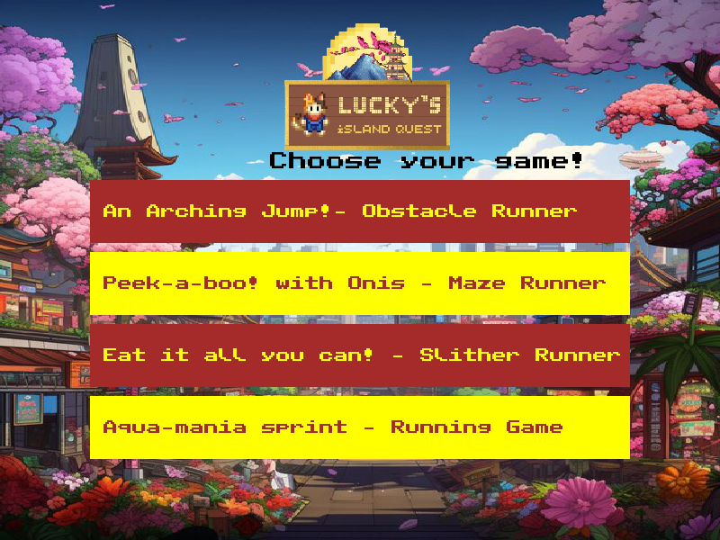
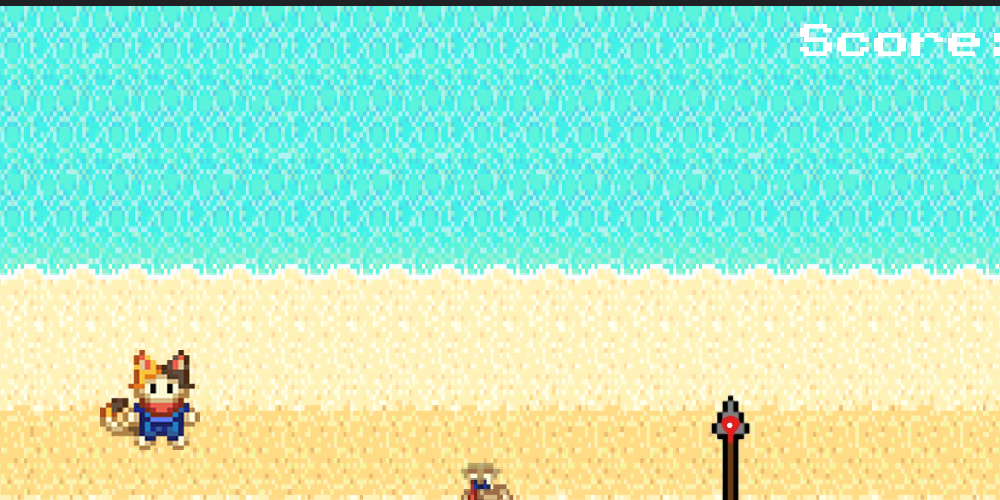
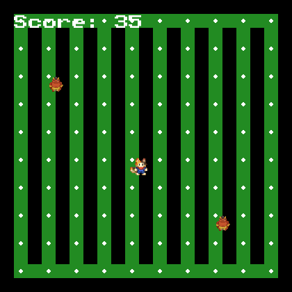
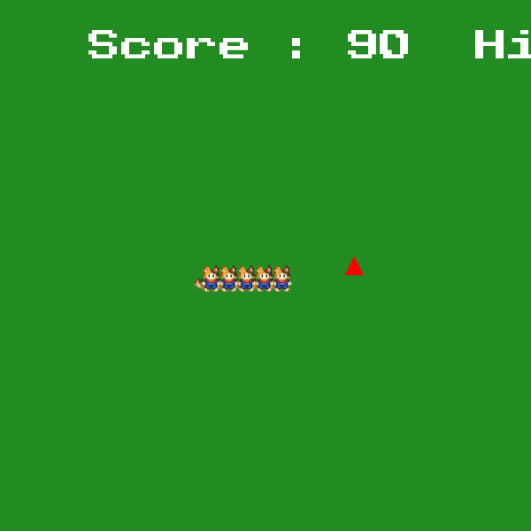
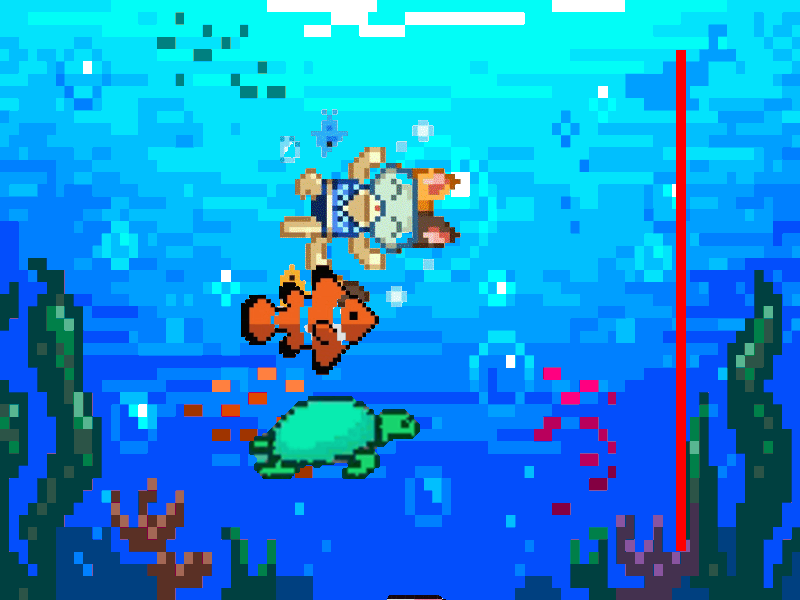

# 🐱 Lucky's Island Quest

Welcome to **Lucky's Island Quest**, a collection of 4 retro mini-games inspired by the *Google Doodle Champion Island Games*! This suite features dynamic video intros, synchronized background music, and challenging arcade gameplay built entirely using Python, Pygame, and Turtle graphics.



---

## 🎮 The Mini-Games

### 1. 🌵 Obstacle Runner (*An Arching Jump!*)
* **Overview**: A Chrome Dino style survival game. Jump over incoming cactus obstacles to increase your score!
* **Features**: Wildly fluctuating speeds and random spawn velocities make this extremely unpredictable and challenging. Includes a custom Game Over overlay.
* **Controls**:
  * `UP Arrow` or `SPACE`: Jump (symmetrical physics)
  * `LEFT / RIGHT Arrows`: Adjust horizontal position on-screen
  * `SPACE` (on Game Over): Restart
  * `ESC` (on Game Over): Exit to main menu



---

### 👹 2. Maze Runner (*Peek-a-boo! with Onis*)
* **Overview**: A Pac-Man style maze escape game. Eat all the dots while evading the red Onis chasing you!
* **Features**: Features on-screen "GAME OVER" and "YOU WIN!" banner announcements when you hit 100 points or get caught.
* **Controls**:
  * `Arrow Keys`: Change movement direction



---

### 🐍 3. Slither Runner (*Eat it all you can!*)
* **Overview**: A classic retro Snake game. Eat food to grow longer, but don't crash into the walls or your own tail!
* **Features**: Dynamic difficulty (speed increases as you grow), and real-time score/high score tracker.
* **Controls**:
  * `Arrow Keys`: Control snake direction



---

### 🏊 4. Aqua-mania Sprint (*Running Game*)
* **Overview**: An intense competitive swimming/running race against three AI opponents.
* **Features**: Double-safety alternate keypress detection prevents holding keys down to cheat. You must tap the keys rapidly to win!
* **Controls**:
  * `LEFT / RIGHT Arrows` (Alternating): Tap Left and Right arrow keys in turns to swim forward.
  * *Holding down keys or pressing the same key twice will not register movement.*



---

## 🎬 Cinematic Intros & Music
* **VLC Video Intros**: Each sport is introduced with its official Doodle animated intro video. Videos are downloaded dynamically from YouTube on the first launch and cached locally for instant play afterwards.
* **Video Skipping**: You can press the **'X'** key, **SPACE**, **ESCAPE**, or click the **(X)** window close button to immediately skip any video and start playing.
* **Retro Soundtracks**: The game suite plays official Doodle Champion Island tracks offline in the background, transitioning seamlessly between themes.

---

## 🛠️ Installation & Setup

### Prerequisites
1. **Python 3.x**: Make sure Python is installed.
2. **VLC Media Player**: Ensure the official [VLC Media Player](https://www.videolan.org/vlc/) desktop application is installed on your computer.

### Step 1: Install Dependencies
Run the following command in your terminal to install the required Python libraries:
```bash
pip install pygame pytubefix python-vlc freegames
```

### Step 2: Run the Game
Execute the main homepage launcher:
```bash
python op.py
```

---

## 📂 Project Structure
* 📂 `games/`: Contains the 4 active playable mini-games (`arrowjumper.py`, `mazeoni.py`, `e.py`, `runningrace.py`).
* 📂 `images/`: Stores all sprites, icons, background images, and game screenshots.
* 📄 `op.py`: The main homepage launcher, video player, and audio manager.
* 📄 `w.ttf`: Custom font.
